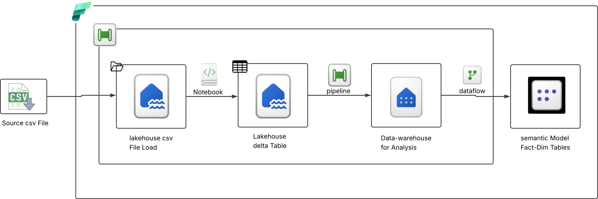

# 🍽️ Swiggy Food Delivery — End-to-End Data Engineering Project
### Microsoft Fabric | PySpark | Delta Lake | Data Warehouse | Semantic Model

## 📌 Project Overview
 
An end-to-end **Data Engineering pipeline** built on **Microsoft Fabric** that ingests raw Swiggy Food Delivery CSV data, applies multi-layer transformations using **PySpark Notebooks**, stores cleaned data as **Delta Tables** in a **Fabric Lakehouse**, loads it into a **Data Warehouse** for SQL analytics, and exposes a **Star Schema Semantic Model** (Fact + Dimension tables) for Power BI reporting.
 
## 🏗️ Architecture Diagram



**Data Flow:**
```
Source CSV File
    → Lakehouse CSV File Load
        → PySpark Notebook (Transformations)
            → Lakehouse Delta Table
                → Pipeline (Orchestration)
                    → Data Warehouse (SQL Analytics)
                        → Dataflow Gen2
                            → Semantic Model (Fact + Dim Tables)
```


## 🏭 Fabric Pipeline Activities:
 
```
Pipeline: [PL_Swiggy_Pipeline]
  │
  ├── Activity 2 : Notebook
  │     Notebook → Handle All transformation in this notebok (e.g. Handling null values)
  │
  ├── Activity 1 : Copy Data
  │     Source  → CSV file Lakehouse Files)
  │     Sink    → Lakehouse Table (raw_swiggy_orders)
  │
  ├── Activity 3 : Dataflow
  │     DataFlow → Created Fact and Dim table to create star schema in semantic model
```

## 🗄️ Data Warehouse

### 📈 Analytics — 20 Business Questions Answered
#### Category 1 — Sales & Revenue
#### Category 2 — Delivery Analytics
#### Category 3 — Customer Behaviour
#### Category 4 — Quality & Ratings

## 🗄️ Dataflow

### Schema Diagram
 
```
                    ┌─────────────────────┐
                    │    Dim_Restaurant   │
                    │─────────────────────│
                    │(PK) restaurant_key   │
                    │    restaurant_name  │
                    │    cuisine_type     │
                    └──────────┬──────────┘
                               │ Many:1
        ┌──────────────────────▼──────────────────────┐
        │                  Fact_Orders                │
        │─────────────────────────────────────────────│
        │ PK order_id                                 │
        │ FK restaurant_key  ──▶ Dim_Restaurant      │
        │ FK location_key    ──▶ Dim_Location        │
        │ FK time_key        ──▶ Dim_Time            │
        │    total_amount                             │
        │    ordered_qty                              │
        │    distance_km                              │
        │    rating_numeric ............              │
        └──────┬────────────────────┬─────────────────┘
               │ Many:1             │ Many:1
    ┌──────────▼──────────┐  ┌──────▼──────────────────┐
    │    Dim_Location     │  │       Dim_Time           │
    │─────────────────────│  │──────────────────────────│
    │ PK location_key     │  │ PK time_key              │
    │    area_name        │  │    day_name              │
    │    city_Name        │  │    full_timestamp        |
    └─────────────────────┘  │    hour                  │
                             │    is_weelend            │
                             └──────────────────────────┘
```


## 👤 Author
 
**[Tanaji Sulagave]** 

Data Engineer | Microsoft Fabric | PySpark | Power BI

[](www.linkedin.com/in/tanaji-sulagave-21268563)

[](https://github.com/tanajisulagave)
